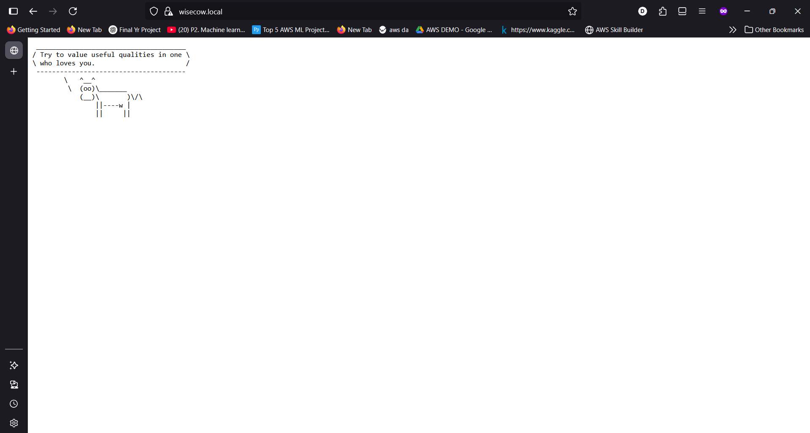

# WiseCow Project

## Overview
The WiseCow Project is a containerized web application that delivers cow wisdom using the `fortune` and `cowsay` commands. It is fully automated with Docker for containerization and CI/CD pipelines for seamless deployment.

## Purpose
We built this project to demonstrate automation, portability, reproducibility, and CI/CD deployment practices. It showcases how to containerize a simple application, set up continuous integration and deployment, and enable secure TLS communication in a Kubernetes environment.

## Key Features
- **Dockerized App**: Fully containerized using Docker for easy deployment and portability.
- **CI/CD Pipeline**: Automated build, test, and deployment using GitHub Actions.
- **TLS-Ready**: Configured for secure TLS communication.
- **Reproducible Environment**: Consistent setup across different environments using Docker and Kubernetes.

## Technologies Used
- **Docker**: For containerization.
- **Bash**: Scripting for the application logic.
- **GitHub Actions**: For CI/CD automation.
- **Docker Hub**: For image registry.
- **Kubernetes**: For orchestration and deployment.

## Project Workflow
1. **Code Push**: Push changes to the repository.
2. **Build**: GitHub Actions triggers a build of the Docker image.
3. **Push**: The built image is pushed to Docker Hub.
4. **Deploy**: The image is deployed to the Kubernetes cluster via manifests.

## Prerequisites
- Docker installed on your machine.
- A GitHub account with access to the repository.
- A Docker Hub account for image storage.
- Kubernetes cluster (e.g., Minikube, GKE) for deployment.

## Installation and Setup
1. Clone the repository:
   ```
   git clone https://github.com/vickydgh/wisecow.git
   cd wisecow
   ```

2. Build the Docker image:
   ```
   docker build -t wisecow .
   ```

3. Run the container:
   ```
   docker run -p 4499:4499 wisecow
   ```

## Usage
Run the script inside the container to start the web server. Point your browser to `http://localhost:4499` or the configured domain.



## CI/CD Pipeline
The CI/CD pipeline is configured using GitHub Actions. It automatically builds and pushes Docker images on code changes, then deploys to Kubernetes.


## Contributing
1. Fork the repository.
2. Create a new branch for your feature.
3. Commit your changes.
4. Push to the branch.
5. Open a pull request.

## License
This project is licensed under the MIT License.
